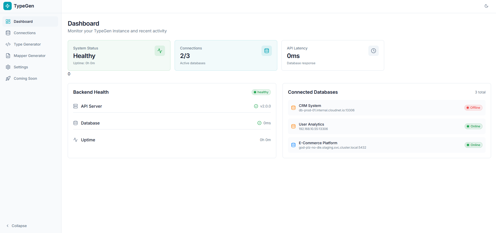
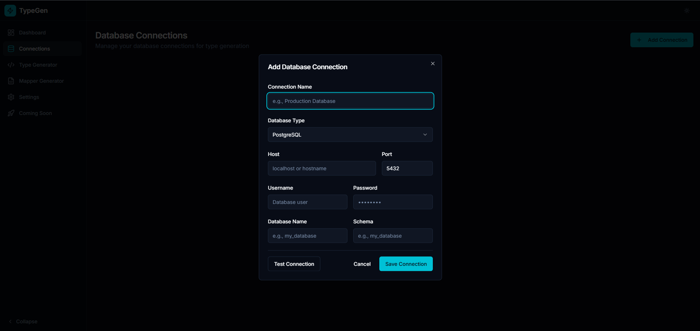
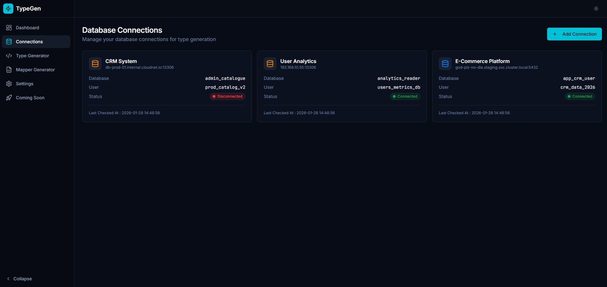
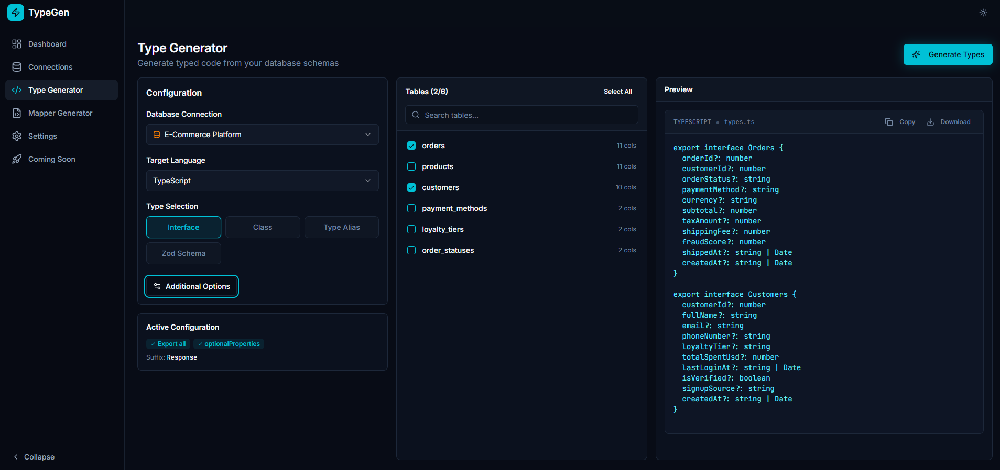
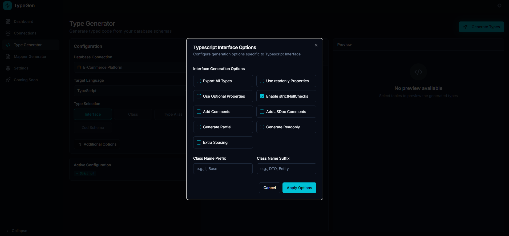
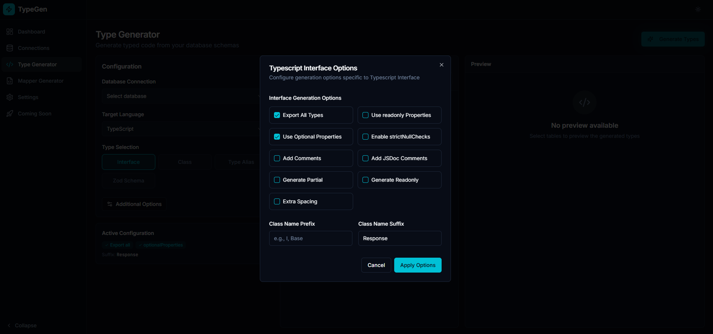
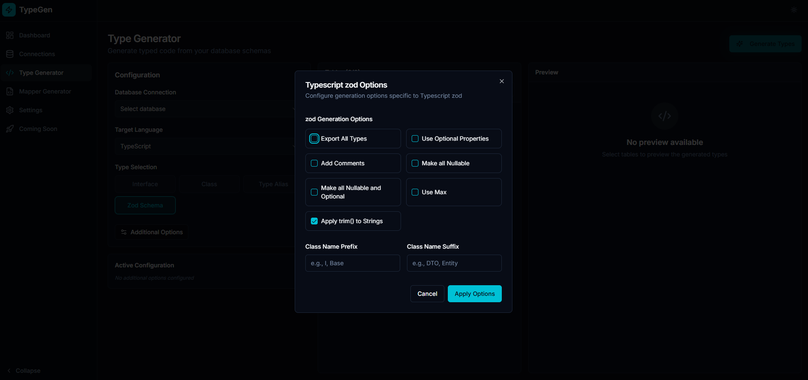
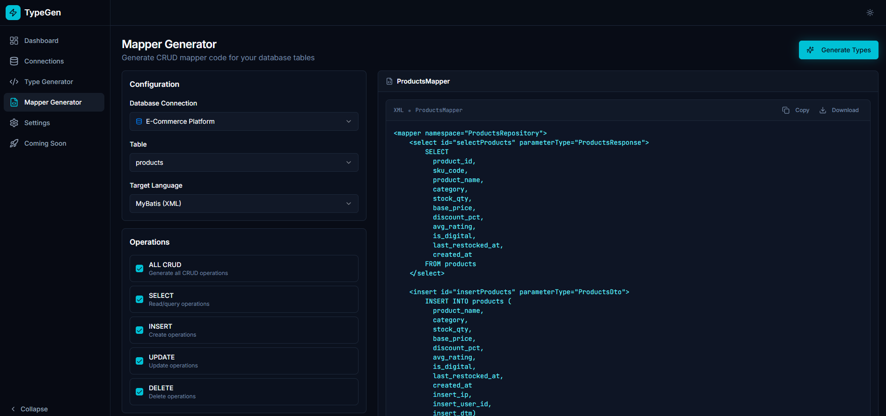
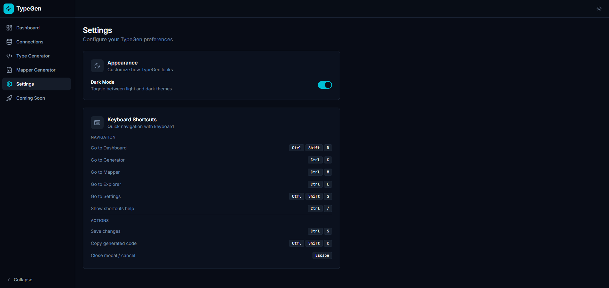
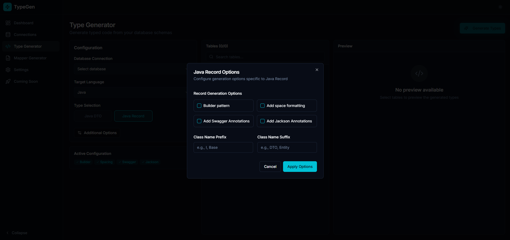

# Typegen UI

<p align="center">
  
</p>

<p align="center">
  <strong>Web interface for managing Typegen workflows</strong><br/>
  Visual • Intuitive • Developer-focused
</p>

<p align="center">
  
  
  
  
</p>

---

## 💻 **Typegen UI**

The **Typegen UI** is a web-based interface that provides a visual workflow for managing database connections,
exploring schemas, configuring generation options, and previewing generated output. It is designed to improve the
developer
experience by offering an intuitive UI on top of the Typegen platform.

> **Important:**
> The UI is **not a standalone application** and should **not be deployed independently**.
> It is provisioned, configured, and controlled by **Typegenctl **, which coordinates its integration with the Typegen
> Server and manages its runtime lifecycle.

| How to use     | Description                                                                           |
| :------------- | :------------------------------------------------------------------------------------ |
| Typegenctl     | [Typegenctl GitHub](https://github.com/khanalsaroj/typegenctl?tab=readme-ov-file)     |
| Typegen Server | [Typegen UI GitHub](https://github.com/khanalsaroj/typegen-server?tab=readme-ov-file) |

## ️🖼️ Usage Demo & Screenshots

### 1. Usage Demo

<p align="center">
  
</p>

### 2. Screenshots

|                                                                          |                                                                        |                                                                |
| :----------------------------------------------------------------------: | :--------------------------------------------------------------------: | :------------------------------------------------------------: |
|                                  **UI**                                  |                           **Add Connection**                           |                      **Connection View**                       |
| [](docs/assets/dashboard_light.png) | [](docs/assets/add_connection.png) | [](docs/assets/connection.png) |
|                         _Light theme dashboard_                          |                           _Add new database_                           |                       _Database details_                       |

|                           **Type Generator**                           |                          **Java Options**                          |                     **TypeScript Options**                     |
| :--------------------------------------------------------------------: | :----------------------------------------------------------------: | :------------------------------------------------------------: |
| [](docs/assets/type_generator.png) | [](docs/assets/options-java.png) | [](docs/assets/options-ts.png) |
|                            _Generate types_                            |                          _Java settings_                           |                     _TypeScript settings_                      |

|                         **Zod Options**                          |                            **Mapper Generator**                            |                       **Settings**                       |
| :--------------------------------------------------------------: | :------------------------------------------------------------------------: | :------------------------------------------------------: |
| [](docs/assets/options-zod.png) | [](docs/assets/mapper_generator.png) | [](docs/assets/setting.png) |
|                          _Zod settings_                          |                               _Data mappers_                               |                      _App settings_                      |

|                                **Record Options**                                 |
| :-------------------------------------------------------------------------------: |
| [](docs/assets/options-java-record.png) |
|                                 _Record settings_                                 |

## 🐳 Docker Image

Pre-built Docker images are available for this project and can be pulled from the registry:

```bash
docker pull ghcr.io/khanalsaroj/typegen-ui:latest
```

## 📂 Project Structure

```text
typegen-ui/
├── public/          # Static assets
├── src/
│   ├── components/  # Reusable UI components (common, generator, ui)
│   ├── hooks/       # Custom React hooks
│   ├── pages/       # Page components (UI, Generator, Mapper, etc.)
│   ├── services/    # API clients and data services
│   ├── types/       # TypeScript type definitions
│   ├── App.tsx      # Root component
│   └── main.tsx     # Entry point
├── index.html       # HTML template
├── tailwind.config.ts # Tailwind CSS configuration
└── vite.config.ts   # Vite configuration
```

## 🔍 Contact

- **Issues:** [Report bugs and feature requests](https://github.com/khanalsaroj/typegenctl/issues)
- **Developer:** Khanal Saroj (waytosarojkhanal@gmail.com)
